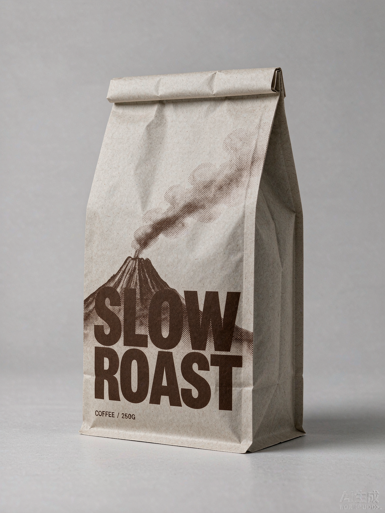
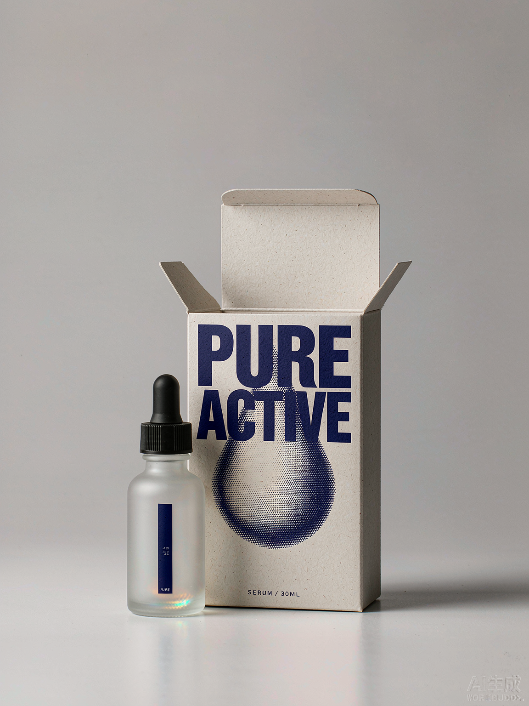
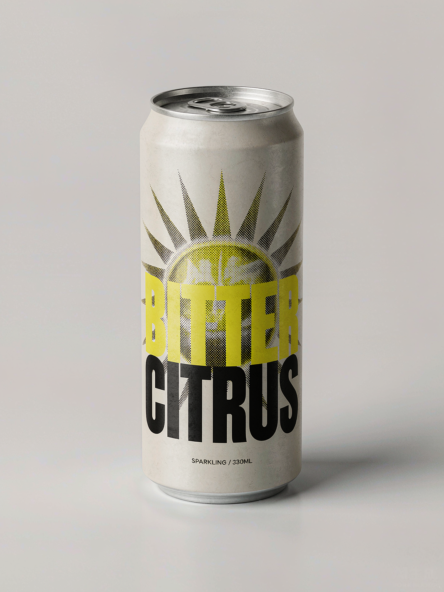
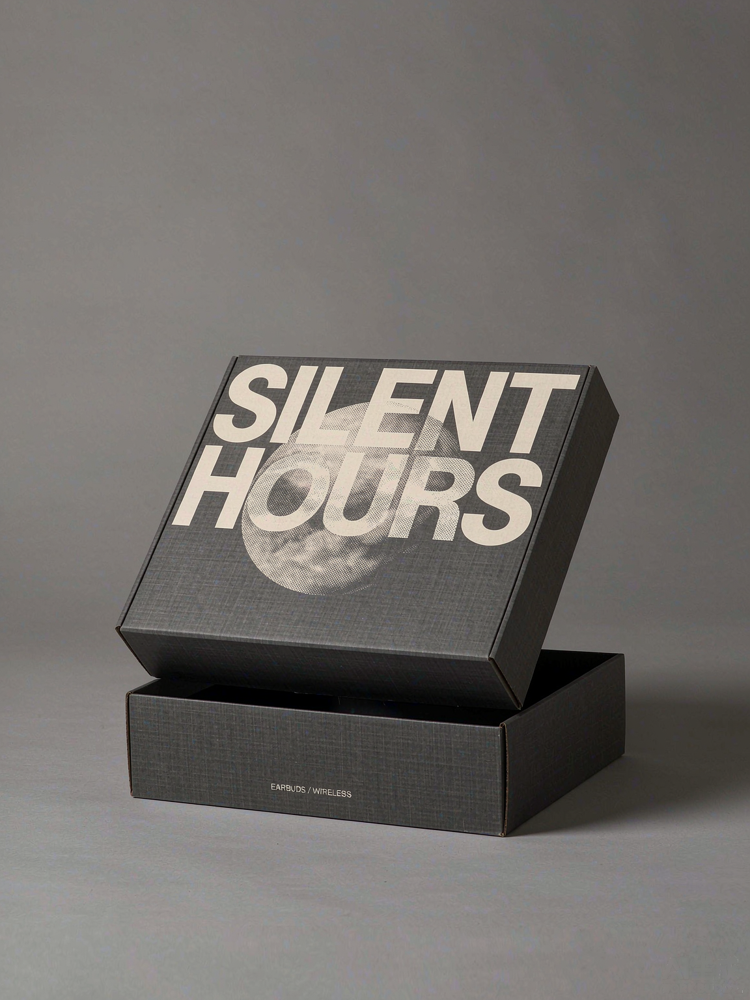

<p align="center">


</p>

<div align="center">

[中文](./README.md) · **English**

# taxue-imagegen · Meta-Prompt Library

> 🧩 **WorkBuddy-exclusive Skill** — this only works inside [WorkBuddy](https://www.workbuddy.cn/docs/workbuddy/Overview): generation goes through WorkBuddy's ImageGen, slot filling and verification run via `scripts/*.py` called by the Agent, and the skill itself is installed into `~/.workbuddy/skills/` with `npx skills add`. Its siblings — taxue-creative-style / taxue-halftone / taxue-solar-polaroid — are portable skills (no platform, model, or Agent lock-in); **this one is the only WorkBuddy-bound skill in the family**.
>
> 🎯 **Tuned for hunyuan-image** — every hard line, ratio, and verification threshold across the four types was measured on hunyuan-image, image by image. Other models work in principle, but text placement, halftone grain, and padding drift; when you switch models, re-run one image through `postcheck.py` and re-check the thresholds.
>
> ⚠️ **Credit cost — read this first** — one ImageGen render costs about **5–10 credits**, and every "look at the image → spot a problem → tweak the prompt → re-render" round is a **brand-new render billed at full price**. Light multi-round polishing adds up fast (3 rounds × 2 images ≈ 30–60 credits). Lock the aspect ratio first and preflight with `preflight.py` — those two steps save the most credits.

**Four tracks, four workflows — turn a sentence, a theme, or a photo into a stable cover, group illustration, packaging mockup, or storyboard.**

[](https://www.workbuddy.cn/docs/workbuddy/Overview)
[](./SKILL.md)
[](#credit-cost)
[](./CHANGELOG.md)
[](./SKILL.md)
[](./SKILL.md)
[](https://github.com/taxueseek/taxue-imagegen/stargazers)
[](https://github.com/taxueseek/taxue-imagegen/actions/workflows/validate.yml)
[](./SKILL.md)

</div>

<p align="center">
  <a href="#examples">Examples</a> ·
  <a href="#three-tracks">Three types</a> ·
  <a href="#four-workflows">Workflows</a> ·
  <a href="#how-to-use">How to use</a> ·
  <a href="#credit-cost">Credit cost</a> ·
  <a href="#what-its-for">What it's for</a> ·
  <a href="#rules">Rules</a> ·
  <a href="#engineering-checks">Engineering</a> ·
  <a href="#changelog">Changelog</a>
</p>

## What this is

taxue-imagegen is not a style library and not a prompt collection — it is a **meta-prompt library + image-generation workflow**, and it is a **WorkBuddy-exclusive image-generation Skill**, built for WorkBuddy's Agent loop and its built-in ImageGen. The hard problem is not "writing one pretty sentence" — it is "making the model reliably produce the expected image every time, and fixing it fast when it doesn't."

It does that with three things:

- **Four tracks** — vertical concept poster (A), hand-drawn group illustration (B), photoreal packaging mockup (C), and narrative storyboard (D), each managing a different figure-text relationship;
- **Mechanical slot filling** — a single source-of-truth prompt template (e.g. `references/poster-v5.md` §1), the LLM never rewrites it, slots are declared verbatim, word counts auto-derived, punctuation pre-validated;
- **One-shot verification** — `scripts/postcheck.py` measures metrics + crops the text band for visual inspection + strips watermarks + appends to `runs.csv`. Verifying one image drops from 3–4 round-trips to 1.

Since v1.6 there's a **data feedback loop for template tuning**: every output is logged to `scripts/logs/runs.csv` (top padding, yellowing R-B, text-band verdict, …). When the next blocker appears, read the table first, then patch the template — never stack a second ad-hoc prohibition.

### Why "WorkBuddy-exclusive"

**It is the platform it's bound to, not a model.** Three dependencies make it WorkBuddy-only:

| Dependency | What it means |
|---|---|
| **Generation** | Calls [WorkBuddy](https://www.workbuddy.cn/docs/workbuddy/Overview)'s ImageGen (text-to-image / image-to-image). The skill owns prompts and verification, not model routing. |
| **Skill loading** | `SKILL.md` frontmatter description + layered `references/` loading + the `/taxue-imagegen` slash command are all driven by WorkBuddy's skill mechanism. |
| **Agent loop** | `fill_meta.py` fills slots → generate → `postcheck.py` verifies → `dewm_v10.py` strips the watermark. That chain needs an Agent running scripts and reading images across turns, not a one-shot prompt. |

Put differently: the other three skills in the family ship **prompts** — copy them out and they run on any client, any model. This skill ships **a pipeline that lives inside WorkBuddy**; taking the prompt with you gets you one third of it.

What works anywhere: `scripts/preflight.py`, `postcheck.py`, `dewm_v10.py`, and `explore.py` are standalone CLIs. Any environment with Python 3 + `numpy` / `pillow` / `opencv-python-headless` can run them — you just don't get the loop above.

### Baseline model: hunyuan-image

Every hard line across the four types — background hex, three-tier copy ratio, top padding, overlap area, countable constraints (largest subject ≤ 1/4 frame, smallest ≥ 1/12), and `postcheck.py`'s pass thresholds — **was measured on hunyuan-image**. Those same numbers are not guaranteed on another model.

- **It's the default**: use this skill inside WorkBuddy and you're on hunyuan-image, matching every sample in this README;
- **Other models work in principle**: GPT Image 2, Grok Imagine 2, Nano Banana 2, Seedream 5.0 Pro all read these prompts without error — but style, text accuracy, and halftone grain will differ;
- **Re-check thresholds when you switch**: render one → `python3 scripts/postcheck.py a.png --track A` → compare the measurements before deciding to relax a hard line. Don't carry hunyuan-image's numbers over blindly.

### Credit cost

Rendering isn't free, and it is **billed per image — no discount for another round**:

| Scenario | Estimate |
|---|---|
| Production mode, 1 image | 5–10 credits |
| Exploration mode, 6 images | 30–60 credits |
| One refinement round (look → tweak prompt → re-render 1) | +5–10 credits |
| Polishing 3 rounds × 2 images each | 30–60 credits |

Three ways to spend less:

1. **Lock the aspect ratio first** (§2) — a wrong size means a re-render at double price; this is the biggest source of waste;
2. **Preflight with `preflight.py`** — hue words on the paper, area percentages, meta text leaking into copy: all caught before you pay;
3. **Batch your edits** — collect several fixes into one round instead of five back-and-forth tweaks on the same image.

> The skill states the estimated cost before rendering, and confirms with you before batch runs (≥5 images). Before each refinement round ask yourself: how many rounds is this image worth?

## Examples

> Images in `examples/` are real outputs from this skill (AI compliance watermark stripped, see [ASSET-LICENSE.md](./ASSET-LICENSE.md)). Type A: three covers, three different styles. Type B: two density tiers. Type C: four packagings matching the four rows of `references/packaging-editorial.md` §2 (coffee pouch / serum bottle + box / beverage can / rigid box), text verbatim-correct (v1.9 r3 4/4 verified).

| Ink Crane (Type A · ink) | SHEER (Type A · intercut) | Char-Matrix (Type A · experimental) |
|:---:|:---:|:---:|
|  |  |  |

| Dog Lineup (Type B · dense) | Travelers (Type B · dense + mixed forms) |
|:---:|:---:|
|  |  |

| SLOW/ROAST (Type C · coffee pouch) | PURE/ACTIVE (Type C · serum bottle + box) |
|:---:|:---:|
|  |  |

| BITTER/CITRUS (Type C · beverage can) | SILENT/HOURS (Type C · rigid box) |
|:---:|:---:|
|  |  |

> All nine samples are free of the "AI 生成 / WORKBUDDY" platform watermark — original outputs were pixel-repaired by `scripts/dewm_v10.py` or `scripts/rmwm.py`. For sharing/redistribution please respect [ASSET-LICENSE.md](./ASSET-LICENSE.md).

## Three types

| Type | Use it for | Template source-of-truth | Entry point |
|---|---|---|---|
| **A · Vertical concept poster** | Concept poster / exhibition KV / album cover / book cover / film mood poster / magazine feature | [`references/poster-v5.md` §1](./references/poster-v5.md) | `scripts/fill_meta.py A` |
| **B · Hand-drawn group illustration** | Multi-character illustration / animal bestiary / character lineup / travel group / journal group | [`references/crowd-illustration.md`](./references/crowd-illustration.md) + [`crowd-themes.md`](./references/crowd-themes.md) | `scripts/fill_meta.py B --theme <theme>` |
| **C · Photoreal packaging mockup** | Studio-lit product mockup (coffee bag / serum bottle / beverage can / rigid box) | [`references/packaging-editorial.md`](./references/packaging-editorial.md) | Template directly (see [SKILL.md Type C](./SKILL.md)) |

**Not sure which?** Is the subject **one** thing or **many** things? One → A, many → B. Want a product mockup → C.

A and C use the size table in `references/size-and-params.md` (default `1024x1536` / 3:4 uses `1152x1536`); B's sizing is in `references/crowd-illustration.md`.

## Four workflows

| Workflow | When | Discipline |
|---|---|---|
| **Production** (default) | Type + template mature, target is a final | Fill → preflight → **generate 1 image only** → three-tier review → done or one targeted fix |
| **Exploration** | New theme / new style / template iteration | `scripts/explore.py` batched prompts + `settle` rename + verify + write back conclusions; single-style 2–5, multi-style 5–9; see [`references/explore-mode.md`](./references/explore-mode.md) |
| **Watermark removal** | Output has bottom-right "AI 生成 / WORKBUDDY" | Default [`scripts/dewm_v10.py`](./scripts/dewm_v10.py) (v9 + flat-area adaptive fusion, 31 ms); tricky images use [`scripts/pick_wm.py`](./scripts/pick_wm.py) four-way picker; all outputs go to `_clean/`, **never overwrite source** |
| **Verification** | Close the loop after generation | [`scripts/postcheck.py`](./scripts/postcheck.py) metrics + 2× text-band crop + dewm + runs.csv logging, <0.5 s |

**Production quota: 1 image by default.** No draft-then-final. No "compare" second image. Only blockers permit one targeted regeneration, changing exactly one thing. **Exploration quota**: single-style 2–5, multi-style 5–9; batches ≤ 3 per round, immediately `ls` and `explore.py settle` to rename-lock (prevents same-second timestamp collisions).

## How to use

Prerequisite: [WorkBuddy](https://www.workbuddy.cn/docs/workbuddy/Overview) installed — this is a WorkBuddy-exclusive image-generation Skill.

Install:

```bash
npx skills add taxueseek/taxue-imagegen
```

Script dependencies (only needed if you use the CLIs standalone — already present inside a WorkBuddy session):

```bash
pip install numpy pillow opencv-python-headless
```

Then just say it **inside WorkBuddy**, e.g.:

- "Type A, a 2:3 concept poster — ukiyo-e style, theme: impermanence, English headline WAITING"
- "Type B, full-bleed dog lineup, 14 dogs, modify with `fill_meta.py B --theme bird`"
- "Type C, a matte serum bottle in a paper box, deep indigo ink, metaphor is a single falling water drop"
- "Run explore_sample.csv in exploration mode, pick one as the main line"

Or trigger with `/taxue-imagegen`. Production mode defaults to 1 image per request — if you want batch exploration, say "exploration mode, N images" explicitly.

**A refinement is a render**: saying "one more version" = one more image = one more charge. State all your edits up front instead of five micro-tweaks — see [Credit cost](#credit-cost).

## What it's for

- **Posters**: events, exhibitions, city walks, concept posters, KVs, album covers
- **Platform covers**: Xiaohongshu, WeChat OA, podcast, Bilibili, avatars, ultra-wide headers
- **Brand material**: postcards, invitations, tickets, menus, packaging stickers (Type C for the actual mockup)
- **Books**: covers, frontispiece, chapter pages, zine inner pages
- **Group illustrations & bestiaries**: character bestiary, animal bestiary, travel group portraits, journal multi-character spreads
- **Text**: literary excerpts, poetry, personal manifestos (Type A's three-tier copy hierarchy)

## Rules

1. **Paper / background rejects hue words** — `warm / aged / faded / unbleached / vintage` are strong hue commands that turn output yellow. For texture use `fibre grain / laid lines / halftone / tooth / deckle`.
2. **Numerics only on crash-prevention items** — background color, three-tier copy ratio, overlap area, accent-color ratio, top padding: lockable. Subject size, scale contrast, position/density: must stay vague.
3. **Area / density percentages are mostly noise to the model** — replace "1/3 padding", "low density" with countable constraints (subject count lower bound, max subject ≤ 1/4 frame, small subject ≥ 1/12) + positive descriptions.
4. **Resolve paths with `find` first** — the archiver normalizes consecutive underscores into one.
5. **Separate meta info from content physically** — weight hints (`= 100`), ratio explanations next to copy are roughly 50% likely to be painted as text.

Full rules plus 22 verified pitfall fixes across tracks: [`references/pitfalls.md`](./references/pitfalls.md).

## Randomness & creativity

The magic of image generation is the artistic side — randomness and creativity are baked in. This is an **engineering-first skill**: every prohibition, hard line, and template is there to make output stable — but it deliberately avoids rigid constraints and doesn't aim to reproduce a fixed look. The same prompt handed to GPT Image 2, Grok Imagine 2, Nano Banana 2, Seedream 5.0 Pro can produce noticeably different results. That creative headroom is intentional — run the same line a few times, pick the one that fits.

**The baseline model is hunyuan-image**: every hard line and threshold here was measured on it — use it and you get the results shown in this README.

Other models work in principle (the prompts are plain English descriptions), but style bias and text accuracy drift. If you switch, render one and re-check with `postcheck.py` first:

- **Known to work**: GPT Image 2, Grok Imagine 2, Nano Banana 2, Seedream 5.0 Pro
- **Re-verify first after switching**: verbatim text accuracy, padding / top space, halftone grain and spot-color rendering

> Switching models costs another round of threshold tuning — and a few more images' worth of credits. With no specific need, staying on hunyuan-image is the cheapest path.

## Engineering checks

The spec doesn't just live in docs: `SKILL.md` slots, templates, hard lines, and verification thresholds all have machine-readable checks. Patch any of them, run the check, see what broke — GitHub Actions runs the same on push and PR.

```bash
bash scripts/run_tests.sh                       # run all checks
python3 scripts/preflight.py "your prompt"     # preflight a single prompt (A/B/C)
python3 scripts/postcheck.py a.png --track A   # verify a single output
```

CI: [`.github/workflows/validate.yml`](./.github/workflows/validate.yml).

## Sibling skills

Same family of image-generation skills — pick the right one for the job. **Note the different bindings**: only taxue-imagegen is WorkBuddy-exclusive (it lives in the WorkBuddy runtime); the other three ship prompts with no platform, model, or Agent lock-in — copy them anywhere.

| Skill | One-liner | Binding | Repo |
|---|---|---|---|
| **taxue-creative-style** (image-style engine) | 14 families, 77 variants: by-style generation, prompt rewriting, from-scratch, remember preferences | Portable (any platform / model) | [taxue-creative-style](https://github.com/taxueseek/taxue-creative-style) |
| **taxue-imagegen** (meta-prompt library + workflow) | 3 tracks + 4 workflows + mechanical slot fill + one-shot verify | **WorkBuddy-exclusive** · tuned for hunyuan-image | **You are here** · [taxue-imagegen](https://github.com/taxueseek/taxue-imagegen) |
| **taxue-halftone** (print-feel engine) | 11 styles + 1 variant: turn a sentence, theme, or photo into a print-feel cover | Portable (any platform / model) | [taxue-halftone](https://github.com/taxueseek/taxue-halftone) |
| **taxue-solar-polaroid** (solar-term engine) | Solar terms, festivals, phenology short lines → memorable posters, paper archives and polaroids | Portable (any platform / model) | [taxue-solar-polaroid](https://github.com/taxueseek/taxue-solar-polaroid) |

## Changelog

- **v1.10.0** (2026-09-08): Add Type D "Narrative Storyboard" — a dual LOCK anchor keeps one character consistent across 9 frames (`references/storyboard.md` + `build_storyboard.py --case cyber|ink`); `fill_meta.py C` turns packaging mockups from hand-copying a 17-slot template into mechanical slot fill; fixes four classes of low-level bugs that actively misled generation (preflight word boundaries falsely blocking 9/9 prompts, `【】` slots undetected, postcheck logging unverified text as pass, overwrite guard bypassed by case/hard links); adds 42 assertion-based regression tests. Default watermark removal stays v10 — v11/v12 measured worse overall and are demoted to optional for dark-region cases.
- **v1.9.1** (2026-09-08): Fix CI failing on every push since publication — three benchmark scripts hard-coded a machine-local path, so `import dewm` failed on the runner (locally they silently picked up same-named modules from `~/.workbuddy/skills/`, which is why the suite passed on the author's machine); all three now resolve their own directory, test images come from `TAXUE_BENCH_IMGS`, and `run_tests.sh` gains a privacy scan while CI runs that same suite.
- **v1.9.0** (2026-09-08): Add Type C "Photoreal Packaging Mockup" — studio-lit physical base + editorial monochrome ink layout + single-metaphor AM halftone graphic + giant stacked brand wordmark, Chinese meta-template with slots (`references/packaging-editorial.md`, three rounds, r3 4/4 text verbatim-correct).
- **v1.8.0** (2026-09-07): Add `dewm_v10` — v9 + flat-area adaptive fusion, fixes "visually visible watermark ghosts on flat backgrounds" (amp says CLEAN but the eye sees residue); flat-background RMS 5.98 → 1.43, textured images byte-identical (zero regression); default watermark removal switches to `dewm_v10.py`.
- **v1.7.0** (2026-09-07): Exploration mode (`explore.py` + CSV-driven); default watermark removal switches to `pick_wm` (v6/v7/v8 each have a specialty; 18-sample test showed v6 missed/left noise on 5 of 18, 28%); add `audit_wm` residual audit (works without source images to flag DIRTY).
- **v1.6.0** (2026-09-07): Single-call `postcheck.py` after generation — metrics + text-band visual crop + dewm reverse-alpha + runs.csv logging; verification round-trips drop from 3–4 to 1; data feedback loop for template tuning.
- **v1.5.0** (2026-09-07): Borrowed `taxue-halftone` pipeline — `fill_meta.py` mechanical slot fill (LLM never rewrites the template, word counts auto-derived); tiered prompt library loading; three-tier review card + 1-image production quota.
- **v1.4.0** (2026-09-06): Size test — `size` accepts arbitrary pixel counts (not just the three schema examples); 1024/1152/1536 long-edge variants all output exactly.
- **v1.0.0** (2026-09-01): Initial release. Two types, five themes, mechanical slot fill, single-source templates. See [CHANGELOG.md](./CHANGELOG.md).

## License

Code, SKILL instructions, scripts, references — [MIT License](./LICENSE).
Images in `examples/` and the header `assets/readme/hero.png` — [ASSET-LICENSE.md](./ASSET-LICENSE.md), not distributed under MIT.