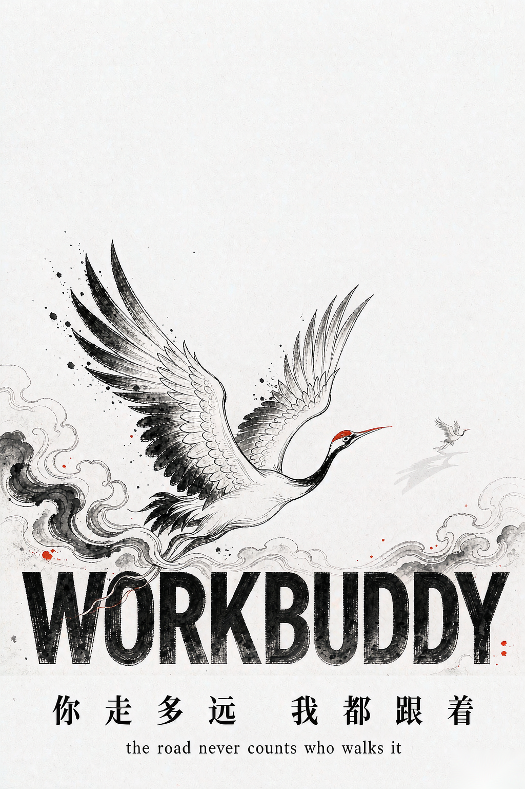
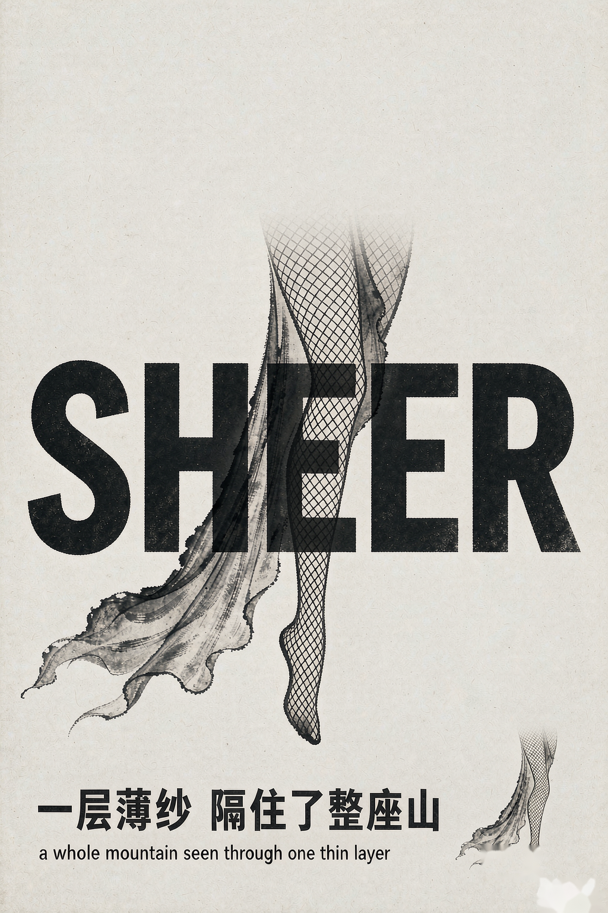
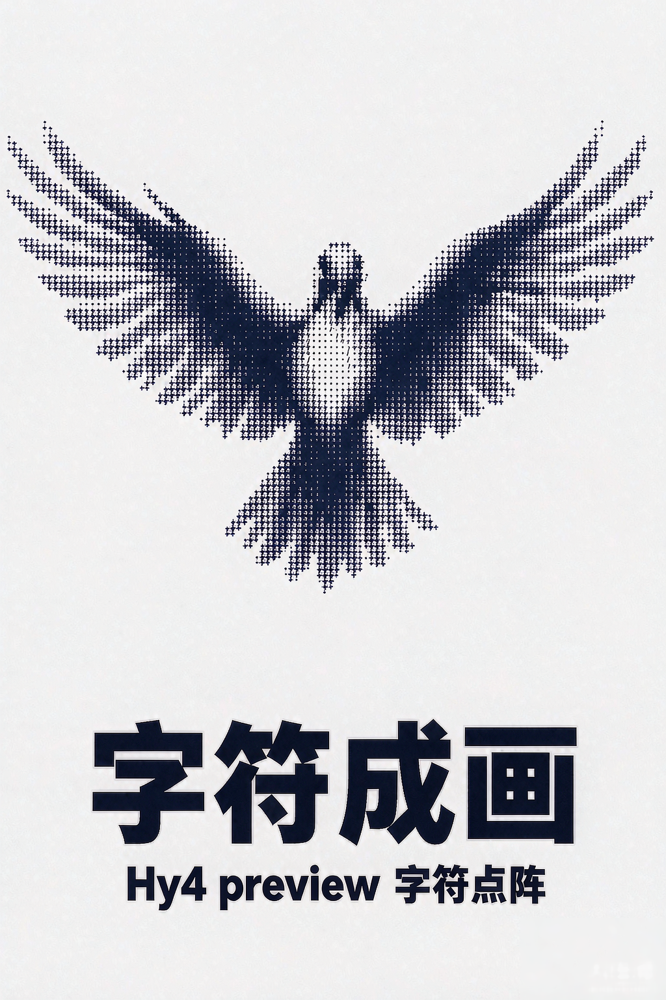
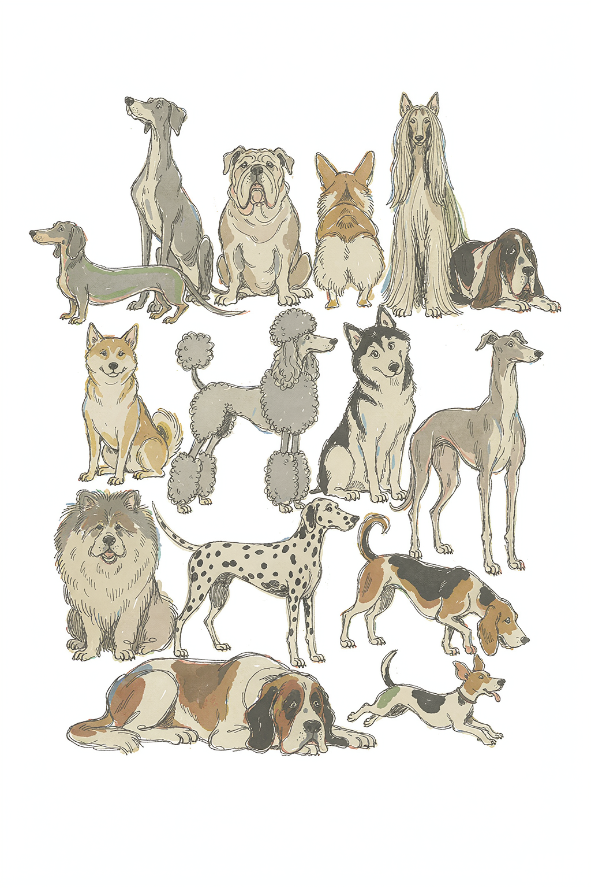
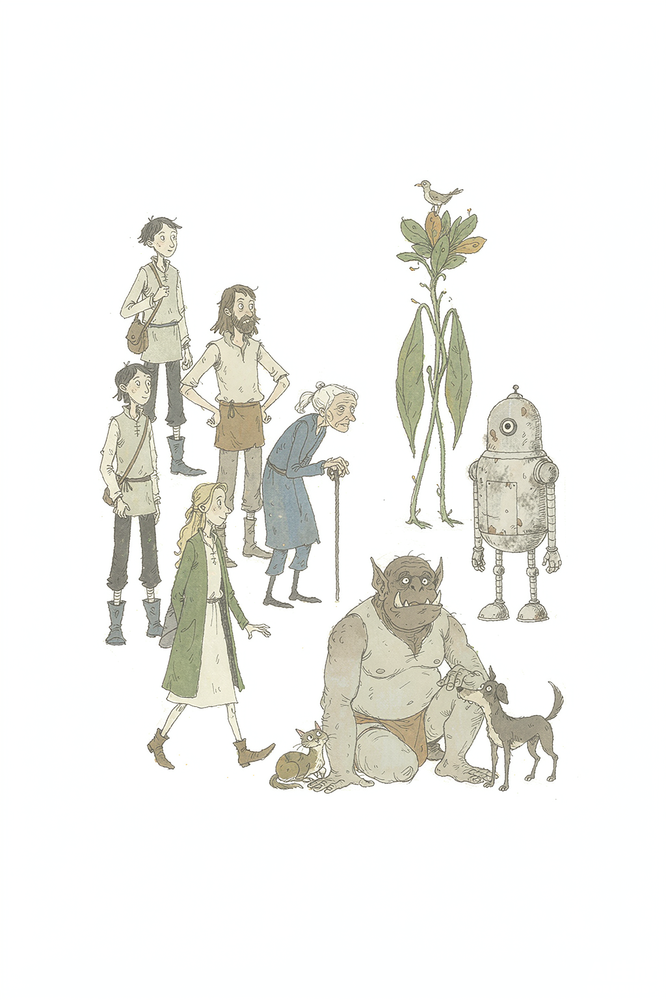

<p align="center">


</p>

<div align="center">

**中文** · [English](./README.en.md)

# taxue-imagegen · 生图元提示词库

**三条赛道、四种工作流——把一句话、一个主题或一张照片，做成一张稳定的封面、群像或写实包装样机。**

[](./CHANGELOG.md)
[](./SKILL.md)
[](./SKILL.md)
[](https://github.com/taxueseek/taxue-imagegen/stargazers)
[](https://github.com/taxueseek/taxue-imagegen/actions/workflows/validate.yml)
[](./SKILL.md)

</div>

<p align="center">
  <a href="#示例作品">示例作品</a> ·
  <a href="#三条赛道">三条赛道</a> ·
  <a href="#四种工作流">工作流</a> ·
  <a href="#怎么用">怎么用</a> ·
  <a href="#适合做什么">适合做什么</a> ·
  <a href="#基本规矩">基本规矩</a> ·
  <a href="#工程校验">工程校验</a> ·
  <a href="#更新记录">更新记录</a>
</p>

## 这是什么

踏雪生图不是一个风格库，也不是一个生图 prompt 模板集——它是一套**元提示词库 + 出图工作流**，专为 WorkBuddy / Agent 循环设计。核心难点不是「写一句漂亮的话」，而是「让模型每次都稳定地产出符合预期的图，并且翻车时能快速定位修复」。

它做这件事的方式是三件套：

- **三条赛道**——竖版概念海报（A）、手绘群像（B）、写实包装 Mockup（C），各自管一种图文关系；
- **机械填槽**——提示词模板单一真源（`references/poster-v5.md` §一 等），LLM 不重抄模板，槽位逐字声明、词数自动推导、标点前置校验；
- **一次验收**——`scripts/postcheck.py` 量测 + 底部文字带目检裁片 + 去水印 + 运行记账，验一张图从 3–4 次工具往返压到 1 次。

v1.6 起建立了模板调优的**数据反馈闭环**：每一张出图自动写到 `scripts/logs/runs.csv`，顶部留白、泛黄 R-B、文字带 OK 与否都进表；下一个 blocker 出现时，先看表，再改模板，而不是临时加禁令。

## 示例作品

> 图片放在 `examples/` 目录，由本技能实际出图产出（已剥离 AI 合规水印，版权见 [ASSET-LICENSE.md](./ASSET-LICENSE.md)）。赛道 A 三张代表三种典型风格，赛道 B 两张代表两种密度等级，赛道 C 见 [SKILL.md §赛道 C](./SKILL.md) 模板（仓库归档时暂无现成样张）。

| 踏雪（赛道 A · 水墨） | SHEER（赛道 A · 穿插型） | 字符点阵（赛道 A · 实验） |
|:---:|:---:|:---:|
|  |  |  |

| 犬种图鉴（赛道 B · 满铺） | 旅行团（赛道 B · 满铺异形） |
|:---:|:---:|
|  |  |

> 五张样张均无「AI 生成 / WORKBUDDY」平台水印——原图出图后经 `scripts/dewm_v10.py` 或 `scripts/rmwm.py` 像素级修复；公开分享请保留 [ASSET-LICENSE.md](./ASSET-LICENSE.md) 中关于样张的版权说明。

## 三条赛道

| 赛道 | 你要什么 | 模板真源 | 入口 |
|---|---|---|---|
| **A · 竖版概念海报** | 概念海报 / 展览 KV / 专辑封面 / 书籍封面 / 电影氛围海报 / 杂志专题 | [`references/poster-v5.md` §一](./references/poster-v5.md) | `scripts/fill_meta.py A` |
| **B · 手绘群像** | 多角色插画 / 动物图鉴 / 角色群像 / 旅行团 / 手账式群像 | [`references/crowd-illustration.md`](./references/crowd-illustration.md) + [`crowd-themes.md`](./references/crowd-themes.md) | `scripts/fill_meta.py B --theme <主题>` |
| **C · 写实包装 Mockup** | 棚拍包装样机（咖啡袋 / 精华瓶 / 饮料罐 / 天地盖硬盒） | [`references/packaging-editorial.md`](./references/packaging-editorial.md) | 模板直填（详见 [SKILL.md §赛道 C](./SKILL.md)） |

**拿不准**：画面主体是**一个**还是**一群**？一个 → A，一群 → B；想出产品包装 → C。

A 与 C 都用 `references/size-and-params.md` 的尺寸表（默认 `1024x1536` / 3:4 用 `1152x1536`），B 的尺寸表见 `references/crowd-illustration.md`。

## 四种工作流

| 工作流 | 什么时候用 | 关键纪律 |
|---|---|---|
| **生产模式**（默认） | 赛道 + 模板已成熟，目标出成品 | 填槽 → 预检 → **只出 1 张** → 三档评审 → 成品或一次定向修复 |
| **探索模式** | 新主题 / 新风格 / 模板迭代 | `scripts/explore.py` 批量出稿 + settle 改名 + 验收 + 结论回写模板；单风格 2–5 张、多风格 5–9 张；详见 [`references/explore-mode.md`](./references/explore-mode.md) |
| **去水印** | 出图后右下角带「AI 生成 / WORKBUDDY」 | 默认走 [`scripts/dewm_v10.py`](./scripts/dewm_v10.py)（v9 + 平底自适应融合，31ms）；疑难图走 [`scripts/pick_wm.py`](./scripts/pick_wm.py) 四版选优；输出全部落 `_clean/`，**绝不覆盖原图** |
| **验收** | 出图后闭环 | [`scripts/postcheck.py`](./scripts/postcheck.py) 量测 + 文字带 2× 裁片 + dewm + runs.csv 记账，<0.5s |

**生产配额：默认 1 张。** 禁止先出草稿再出成品；禁止为「对比」再出一张；仅 blocker 允许一次定向重生，只改一项。**探索配额**：单风格 2–5 / 多风格 5–9；出图分批 ≤ 3/批，每批立即 `ls` 核对 + `explore.py settle` 改名锁定（防同秒时间戳撞名）。

## 怎么用

安装：

```bash
npx skills add taxueseek/taxue-imagegen
```

装好后直接说，例如：

- 「用赛道 A 做一张 2:3 概念海报，视觉风格浮世绘、主题无常、英文标题 WAITING」
- 「赛道 B 来一张满铺犬种图鉴，14 只、主题用 `fill_meta.py B --theme 鸟` 改法」
- 「赛道 C 来一张磨砂精华瓶的纸盒包装，色用深靛蓝，隐喻图形是一颗下落的水滴」
- 「把 explore_sample.csv 跑一遍探索模式，挑一张作主线」

也可以输入 `/taxue-imagegen` 触发。每次会按生产模式默认只出 1 张；如果你想批量探索，明说「探索模式 N 张」。

## 适合做什么

- **海报**：活动、展览、城市漫游、概念海报、KV、专辑封面
- **平台封面**：小红书、公众号、播客、B 站、头像、超宽头图
- **品牌物料**：明信片、邀请函、门票、菜单、包装贴纸（用赛道 C 出实物样机）
- **书刊**：封面、扉页、章节页、zine 内页
- **群像与图鉴**：人物图鉴、动物图鉴、旅行团合影、手账式多角色
- **文字**：文学摘句、诗歌、个人宣言（用赛道 A 三组文字层级）

## 基本规矩

1. **纸底/背景不接受色相词**——`warm / aged / faded / unbleached / vintage` 是强色相指令，会泛黄；想要质感用纹理词（`fibre grain / laid lines / halftone / tooth / deckle`）
2. **数值只用在防翻车项**——背景色、文字三级比例、交叠面积、强调色占比、顶部留白可以锁；主体大小、尺度反差倍数、位置疏密必须留模糊
3. **面积/密度百分比对模型基本无效**——「留白 1/3」「低密度」换成可数约束（角色数量下限、最大角色 ≤ 画幅 1/4、小角色 ≥ 1/12）+ 正向描述
4. **路径名先 `find` 再引用**——归档脚本会把连续下划线规范化成单个
5. **元信息与内容物理分离**——权重标注（`= 100`）、比例说明不要和文案连写，否则约 50% 概率被原样画进画面

完整规则、跨赛道 22 个已踩坑的修复写法见 [`references/pitfalls.md`](./references/pitfalls.md)。

## 随机性与创造力

生图模型的精髓在艺术那一面，自带随机性与创造力。这是个**工程优先的技能**，所有禁令、硬底线、模板都是为了让模型稳定——但它特意没有做僵化的约束，也不追求复刻一个固定的效果。同一段提示词交给 GPT Image 2、Grok Imagine 2、Nano Banana 2、Seedream 5.0 Pro，出图的风格有时候会有较大不同。这是有意保留的创作空间——同一句话多跑几次，常能撞出不同的好图，挑一张最对的用。

选模型的经验（个人建议）：

- **主力创作**：GPT Image 2、Grok Imagine 2
- **后备**：Nano Banana 2、Seedream 5.0 Pro

## 工程校验

规范不只写在文档里：`SKILL.md` 的槽位、模板、硬底线、验收阈值都有机器可读的清单，配有 Python 校验脚本。改任何一处，跑一遍检查就能发现有没有改坏，push 或提 PR 时 GitHub Actions 会自动跑。

```bash
bash scripts/run_tests.sh                       # 一次跑完所有检查
python3 scripts/preflight.py "你的 prompt"     # 单条 prompt 预检（A/B/C 通用）
python3 scripts/postcheck.py a.png --track A   # 单张图验收
```

CI 详见 [`.github/workflows/validate.yml`](./.github/workflows/validate.yml)。

## 集成与同类

同属踏雪生图系列，先认门，再用对技能：

| 技能 | 一句话 | 仓库 |
|---|---|---|
| **踏雪创意风格**（影像风格引擎） | 14 个家族、77 个变体：按风格出图、改提示词、从零写、记住偏好 | [taxue-creative-style](https://github.com/taxueseek/taxue-creative-style) |
| **踏雪生图**（元提示词库 + 出图工作流） | 三条赛道 + 四种工作流 + 机械填槽 + 一次验收 | **你在这里** · [taxue-imagegen](https://github.com/taxueseek/taxue-imagegen) |
| **踏雪半调海报**（印刷质感引擎） | 11 种风格 + 1 个变体：一句话、一个主题或一张照片，做成印刷感封面 | [taxue-halftone](https://github.com/taxueseek/taxue-halftone) |
| **踏雪节气拍立得**（节气创作引擎） | 节气、节日、物候短句，推出有记忆点的海报、纸本档案与拍立得 | [taxue-solar-polaroid](https://github.com/taxueseek/taxue-solar-polaroid) |

## 更新记录

- **v1.9.0**（2026-09-08）：新增赛道 C「写实包装 Mockup」——棚拍实物做底 + 编辑风单色专色版面 + 单一隐喻图形 AM 网点 + 巨型堆叠品牌字，中文元模板槽位化（`references/packaging-editorial.md`，三轮实测 r3 4/4 文字逐字全对）
- **v1.8.0**（2026-09-07）：新增 `dewm_v10`——v9 + 平底自适应融合，修「平色底上肉眼可见的水印残影」（amp 判 CLEAN 但人眼仍有痕），平底图 RMS 5.98→1.43，纹理图逐位不动零回归；标准水印默认改走 `dewm_v10.py`
- **v1.7.0**（2026-09-07）：探索模式（`explore.py` + CSV 驱动）；去水印默认改 `pick_wm` 三版选最优（v6/v7/v8 各有擅长，实测 18 张原 v6 漏清/留噪点 5 张占 28%）；新增 `audit_wm` 残留审计（无原图也能定位 DIRTY 张）
- **v1.6.0**（2026-09-07）：出图后一次调用 `postcheck.py`——量测 + 文字带目检裁片 + dewm 反解去水印 + runs.csv 记账，验收路径从 3-4 次工具往返压到 1 次，建立模板调优的数据反馈闭环
- **v1.5.0**（2026-09-07）：借鉴 `taxue-halftone` 流水线，`fill_meta.py` 机械填槽（LLM 不重抄模板、逐字声明自动推导）；提示词库分层加载；三档评审卡 + 出图配额 1 张
- **v1.4.0**（2026-09-06）：尺寸实测——`size` 实测支持任意像素（不止官方 schema 的三示例），1024/1152/1536 三档长边精确输出
- **v1.0.0**（2026-09-01）：首次发布。两条赛道、五个主题、机械填槽、模板单一真源。详见 [CHANGELOG.md](./CHANGELOG.md)

## License

代码、SKILL 指令、scripts、references 等软件部分走 [MIT License](./LICENSE)；`examples/` 里的示例图与 `assets/readme/hero.png` 头图走 [ASSET-LICENSE.md](./ASSET-LICENSE.md)，不随 MIT 分发。