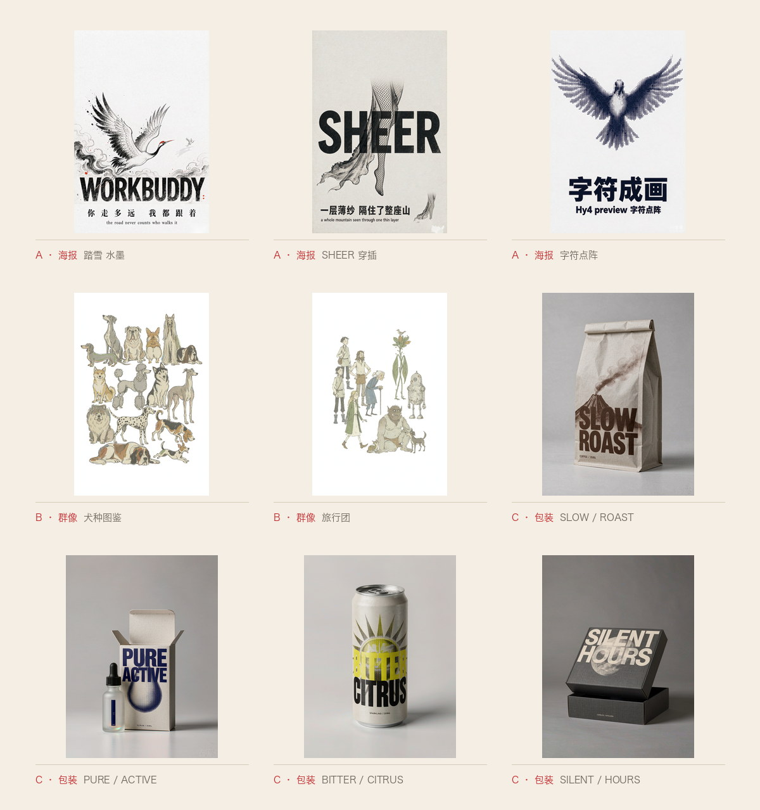
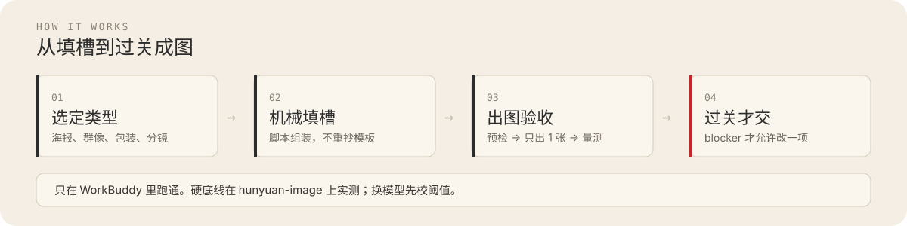

<p align="center">


</p>

<p align="center">
  <a href="./README.en.md">English</a> ·
  <a href="#成图标本">成图</a> ·
  <a href="#五种类型">类型</a> ·
  <a href="#怎么工作">怎么工作</a> ·
  <a href="#开始使用">开始使用</a>
</p>

# 踏雪生图

五种类型、四种工作流——把一句话做成稳定的封面、群像、包装样机、多格组图或分镜。

[](./CHANGELOG.md)
[](https://github.com/taxueseek/taxue-imagegen/releases/latest)

只在 [WorkBuddy](https://www.workbuddy.cn/docs/workbuddy/Overview) 里跑通。出图走它的 ImageGen，填槽和验收由脚本完成。同系列另外三个技能交的是提示词本身，复制到哪都能用；本技能交的是一条跑在 WorkBuddy 里的流水线。

硬底线和验收阈值都在 hunyuan-image 上实测。单张大约 5–10 积分，改一版等于再出一张。

## 生图技能家族

同属踏雪生图系列，先认门，再用对技能：

| 技能 | 一句话 | 仓库 |
|---|---|---|
| **踏雪创意风格**（影像风格引擎） | 14 个家族、77 个变体：按风格出图、改提示词、从零写、记住偏好 | [taxue-creative-style](https://github.com/taxueseek/taxue-creative-style) |
| **半调海报**（印刷质感引擎） | 12 种风格 + 2 个变体：一句话、一个主题或一张照片，做成印刷感封面 | [taxue-halftone](https://github.com/taxueseek/taxue-halftone) |
| **节气拍立得**（节气创作引擎） | 节气、节日、物候短句，推出有记忆点的海报、纸本档案与拍立得 | [taxue-solar-polaroid](https://github.com/taxueseek/taxue-solar-polaroid) |
| **踏雪生图**（元提示词库） | 五种类型 + 四种工作流 + 机械填槽 + 一次验收 | **你在这里** · WorkBuddy 专属 · [taxue-imagegen](https://github.com/taxueseek/taxue-imagegen) |

## 成图标本

类型 A 三张、类型 B 两张、类型 C 四张，都是本技能实际出图。点题名看原图。



<p align="center">
<a href="./examples/example-A-crane-ink.png">踏雪</a> ·
<a href="./examples/example-A-sheer-silk.png">SHEER</a> ·
<a href="./examples/example-A-char-matrix.png">字符点阵</a> ·
<a href="./examples/example-B-dog-lineup.png">犬种图鉴</a> ·
<a href="./examples/example-B-travelers.png">旅行团</a> ·
<a href="./examples/example-C-01-coffee-pouch.png">SLOW/ROAST</a> ·
<a href="./examples/example-C-02-glass-serum.png">PURE/ACTIVE</a> ·
<a href="./examples/example-C-03-beverage-can.png">BITTER/CITRUS</a> ·
<a href="./examples/example-C-04-lidded-box.png">SILENT/HOURS</a> ·
<a href="./examples/README.md">全部原图</a>
</p>

样张已去掉平台水印。版权见 [ASSET-LICENSE.md](./ASSET-LICENSE.md)。

## 五种类型

| 类型 | 你要什么 | 入口 |
|---|---|---|
| **A · 竖版概念海报** | 概念海报、展览 KV、专辑封面、书籍封面 | `scripts/fill_meta.py A` |
| **B · 手绘群像** | 多角色插画、动物图鉴、旅行团 | `scripts/fill_meta.py B --theme <主题>` |
| **C · 写实包装 Mockup** | 棚拍包装样机（咖啡袋 / 精华瓶 / 饮料罐 / 天地盖硬盒） | `scripts/fill_meta.py C` |
| **D · 叙事分镜** | 漫剧切片、绘本连环画、同角色多场景（6–9 帧） | `scripts/build_storyboard.py --case cyber\|ink` |
| **E · 多格排版** | 精灵图、系列海报、邮票组、表情包、角色设定表（每格都是独立成品，靠统一规格串成一组） | `scripts/fill_meta.py E --list` |

拿不准：画面主体是**一个**还是**一群**？一个 → A，一群 → B；要产品包装 → C；要连续叙事 → D；要**一组各自成立的成品**（精灵图 / 系列海报 / 邮票组）→ E。

## 四种工作流

| 工作流 | 什么时候用 | 关键纪律 |
|---|---|---|
| **生产模式**（默认） | 类型和模板已成熟，目标出成品 | 填槽 → 预检 → **只出 1 张** → 三档评审 |
| **探索模式** | 新主题、新风格、模板迭代 | `scripts/explore.py` 批量出稿；单风格 2–5 张、多风格 5–9 张 |
| **去水印** | 出图后右下角带「AI 生成 / WORKBUDDY」 | 默认 `scripts/dewm_v10.py`；输出落 `_clean/`，不覆盖原图。**平台署名**（横版渠道后贴的固定图案）不是平铺水印，`dewm` 全族对它必报 `k̂≈0`——改走 `scripts/dewm_imprint.py`，须同系列多张一起跑 |
| **验收** | 出图后闭环 | `scripts/postcheck.py` 量测 + 文字带裁片 + 去水印，一次调用 |

生产配额默认 1 张。禁止先出草稿再出成品。只有 blocker 才允许改一项重生。

## 怎么工作

<p align="center">
  
</p>

核心不是写一句漂亮的话，是让模型每次都稳定出符合预期的图，翻车时能快速定位。做法是三件套：五种类型各管一种图文关系；脚本机械填槽，不重抄模板；出图后一次验收。

## 开始使用

前提：已安装 [WorkBuddy](https://www.workbuddy.cn/docs/workbuddy/Overview)。

```bash
npx skills add taxueseek/taxue-imagegen
```

不用 CLI 也行：从 [Releases](https://github.com/taxueseek/taxue-imagegen/releases/latest) 下载 `taxue-imagegen-v*.zip`，解压后把 `taxue-imagegen/` 目录整个放进技能目录（`~/.workbuddy/skills/`）。包内只有可安装载荷，由发布标签的跟踪树直接导出、与标签逐字节一致，`SHA256SUMS` 随附可校验。

只用 CLI 时再装依赖（WorkBuddy 会话内已就绪）：

```bash
pip install numpy pillow opencv-python-headless
```

装好后在 WorkBuddy 里直接说，例如：

- 「用类型 A 做一张 2:3 概念海报，视觉风格浮世绘、主题无常、英文标题 WAITING」
- 「类型 B 来一张满铺犬种图鉴」
- 「类型 C 来一张磨砂精华瓶的纸盒包装，色用深靛蓝」
- 「把 explore_sample.csv 跑一遍探索模式」

也可以输入 `/taxue-imagegen` 触发。默认只出 1 张。想批量探索，明说「探索模式 N 张」。

说「再改一版」= 再出一张 = 再扣一次积分。修改点一次说清，比分五次微调省得多。

## 积分消耗

出图按张计费：

| 场景 | 估算 |
|---|---|
| 生产模式出 1 张 | 5–10 积分 |
| 探索模式跑 6 张 | 30–60 积分 |
| 一轮改进（看图 → 改提示词 → 重出 1 张） | 再 5–10 积分 |

省积分的三步：先定画幅；先跑 `preflight.py`；把几处问题攒成一轮改完。批量出图（≥5 张）会先跟你确认。

## 适合做什么

- **海报**：活动、展览、概念海报、KV、专辑封面
- **平台封面**：小红书、公众号、播客、B 站、头像、超宽头图
- **品牌物料**：明信片、邀请函、包装贴纸（用类型 C 出实物样机）
- **书刊**：封面、扉页、章节页、zine 内页
- **群像与图鉴**：人物图鉴、动物图鉴、旅行团合影
- **文字**：文学摘句、诗歌、个人宣言（用类型 A 三组文字层级）

## 基本规矩

1. **纸底不接受色相词**——`warm / aged / faded / vintage` 会泛黄；想要质感用纹理词（`fibre grain / laid lines / halftone`）
2. **数值只用在防翻车项**——背景色、文字比例、交叠面积可以锁；主体大小、位置疏密必须留模糊
3. **面积百分比对模型基本无效**——换成可数约束（最大角色 ≤ 画幅 1/4、小角色 ≥ 1/12）
4. **元信息与内容分开写**——权重标注不要和文案连写，否则大约一半概率被画进画面

完整规则见 [`references/pitfalls.md`](./references/pitfalls.md)。

## 随机性与创造力

这是个工程优先的技能，禁令和硬底线是为了稳定——但它没有做僵化约束，也不追求复刻一个固定效果。同一段提示词交给 GPT Image 2、Grok Imagine 2、Nano Banana 2、Seedream 5.0 Pro，风格有时差得很大。这是有意留的创作空间。

基准模型是 hunyuan-image。换模型先跑一张 + `postcheck.py` 校阈值。没有明确诉求时，留在 hunyuan-image 上最省。

## 工程校验

```bash
bash scripts/run_tests.sh                       # 一次跑完所有检查
python3 scripts/preflight.py "你的 prompt"     # 单条 prompt 预检
python3 scripts/postcheck.py a.png --track A   # 单张图验收
```

CI 详见 [`.github/workflows/validate.yml`](./.github/workflows/validate.yml)。

## 更新记录

- **v1.22.2**（2026-09-23）：**量化驱动的性能轮**——默认验收路径里最大的一笔纯 Python 开销换成了 C 层算子：`measure.metrics` 原先把 256 宽缩略图展开成 9.8 万个 RGB 三元组、再对同一批像素做十几趟 `min()`/`max()`，现改用 `ImageChops` + 直方图 + `ImageStat.Stat(im, mask)`。**单次 126 ms → 31 ms**，在 **304 张已归档成品上与原实现逐字段比对，最大误差 0.0**；`postcheck --wm off` 快 38%、默认 `--wm auto` 快 26%。**常驻面 SKILL.md 33,234 → 30,056 B（−9.6%）**：即梦 2K 尺寸表从 SKILL.md 下沉到 `references/jimeng-env.md` #9.0（原先那张表在常驻面、按需文件反倒指回它，正是分层原则要防的方向），#6/#9 正文压成指针、#8 索引压掉 1.1 KB；符号统一（`§`→`#`、全角圆括号改半角，**仅散文**，围栏模板一律不碰）。修五个**一类**缺陷：`dewm_v11` 的「1−α 过小」守卫因取到已裁剪的 α 而**从未生效**；α 模板框没夹进画面，畸变尺寸（1600×100 / 1×1）会让整条验收以 `ValueError` / `cv2.error` 崩掉；`sync_release.sh` 会把「已验证风格的提示词原文」同步进发布仓（`--exclude='_prompts'` 匹配不到 `_prompts_archive`）；`dewm2`/`rmwm` 整批失败仍报成功；`rmwm_light` 读不了图时 traceback + 退出码 1（= blocker）。断言 288 → 317，**Python 3.9 / 3.13 / 3.14 三套解释器下全绿**。详见 [CHANGELOG.md](./CHANGELOG.md)。
- **v1.22.1**（2026-09-23）：（收尾又补三处：`paper_white._box_mean` 的窗口不居中、偏一格，脉冲响应可测；`fill_meta B --theme 百相` 此前打印的是方法说明与 23 行指标表而非提示词，真提示词在独立文件里；类型 E 对同一张图解码两次，现复用已打开的图，40 张真实成品逐字段比对完全一致。）**新增本地使用日志**（`scripts/_log.py` + `scripts/log_report.py`）——每次脚本调用记一行（哪个脚本、退出码、耗时、宿主、Python 版本），`log_report.py` 把它读成「下一步该改什么」：调用频次 / 崩溃率 / 耗时 p50·p95 / 环境画像 / **从没被调用过的脚本** / `runs.csv` 高频码。只落本地、不进发布仓、不记参数值与绝对路径、写失败静默跳过；并发用单次 `O_APPEND` 写（实测 12 进程 92 行零坏行）。**过去每踩一坑就改文档，现在数据先落地、攒够频次再回写**。同批修掉六个**一类**缺陷：`--out` 传源目录会静默覆盖原图（dewm2/rmwm/rmwm_light/dewm_imprint 四处各自手写路径、没调用库里已有的守卫）、重定向到 `_clean/` 时不建目录（`dewm_v10.py a.png --out <源目录>` 直接 `FileNotFoundError`）、工具自身失败被报成 blocker（未捕获异常退出码 1 = blocker，Agent 会据此白扣 5–10 积分定向重生；现收敛为退出码 4）、`--help` 被默默忽略并真把活干了（`build_storyboard_ink.py --help` 真写 9 个 prompt 文件）、同一行出现两个同名诊断码（类型 E 恒定假诊断，`runs.csv` 长期两个 `grid_diag`）、`dewm_imprint.py` 漏接 `_env` 且把 16 位输入静默变纯白仍报 `[ok]`。另修 preflight 末行无换行会吃掉最后一个字符、`jimeng` 重复比例报的尺寸与产物不一致、`fill_meta` 写 `--out` 失败与「preflight 有阻断」同码等 8 处单点问题。常驻面第三轮去重（删三张「何时读哪个文件」表之间的重复叙述），并修正 4 处事实错误（坑数 35→37、pitfalls 104→114 KB、CHANGELOG 34→49 KB、`_env.py` 此前未被索引）。断言函数 32→37、回归 200→221 项；**Python 3.9.6 / 3.13.12 / 3.14.7 三套解释器下全绿**。详见 [CHANGELOG.md](./CHANGELOG.md)。
- **v1.22.0**（2026-09-23）：**资产盘点驱动的补库**——技能有 18 个入库风格，而 `runs.csv` 台账里还躺着 **13 个已实测 pass 却从未入库的风格**（根因是 `note` 字段从不记风格，只能靠文件名反推），已全部回流为 `poster-v5.md #六·戊`；同时登记 3 个高失败率风格黑名单（前卫构成主义 4/4 blocker、中式复古丝网印 4/4 blocker、苏绣 2/2 blocker）。新增类型 A 第二个/第三个段落级变体：**#一·丙 横版 16:9 + 两级文字**（含一条硬经验：副标题绝不放右下角，平台署名水印恒在那儿而 `dewm_imprint.py` 须同系列多张一起跑）与 **#一·丁 图形规则系统型**（11 种图形规则的主/辅搭配与三条硬规矩）。**更正尺寸结论**：16:9 可直接要 `1536x864`，不必后期裁（原「没有精确 16:9、横版取 3:2 再裁」被实测推翻）。详见 [CHANGELOG.md](./CHANGELOG.md)。
- **v1.21.2**（2026-09-23）：**新增坑 37**——RISO 双色高对比 + 大面积平白海报上，`postcheck --wm auto` 报 `SUSPECT(|amp|=1.37)` 实为**假警报**（1.37/255 ≈ 0.5%，肉眼不可分辨；`dewm_v10.py` 自己的可见度门控也先拒了它）。判定口径升为两步：`|amp| < 2.0` 且平白区 std≈0、放大裁片无字形 → **直接结项**，不要为消掉 pending 去跑 `pick_wm`（四版选优会对干净图各自反解出噪声）。并记下反例边界：合成网点图走的是「高 amp + 低 R²」的另一条分支，据此复现会得出相反结论。详见 [CHANGELOG.md](./CHANGELOG.md)。
- **v1.21.1**（2026-09-23）：修 v1.21.0 发布后 CI 报红的根因——`_env` 的解释器候选只判「文件存在」不判「真能跑」，CI 上 `/usr/bin/python3` 存在却没有 cv2，于是「换解释器重跑」这条修复路径指向一个同样跑不起来的解释器（本地绿、CI 红）。改为**实测能导入缺的那些模块**才算候选，一个都过不了就明说「本机没找到」；对应用例去掉本机专有断言，改判行为。详见 [CHANGELOG.md](./CHANGELOG.md)。
- **v1.21.0**（2026-09-23）：**平台署名水印可原地去除**——新增 `scripts/dewm_imprint.py`（跨图共识掩膜 + αM 反解 + 混合路由；署名是生成后另贴的固定图案、不是平铺水印，所以 `dewm` 全族对它必然报 `k̂≈0`），须同系列多张一起跑。修 preflight 第三处假阳性：段落标题豁免由硬编码白名单改为**行位置**判据（手写模板不再被误报「残留槽位」，回归 192 项）。写回平台实测口径：实际模型 `hunyuan-image-alpha`、单张 5.71 积分、`quality` 未必上链。详见 [CHANGELOG.md](./CHANGELOG.md)。
- **v1.20.1**（2026-09-18）：修 `runs.csv` 表头错列——旧版升上来的机器此后每行都错位，正好废掉 reason 归因码要解决的问题；`align_log()` 写前校验表头并按各自列序归位，真实日志 12 条历史备注零丢失。
- **v1.20.0**（2026-09-18）：审查轮——修验收口径漂移（子技能仍挂着已撤的 blocker，会让 Agent 照旧误判重生、白扣积分）；新增 SKILL 与验收子技能的一致性门禁；常驻面二期再瘦身（SKILL.md 34,228 → 29,652 B，−13%）；回归测试按域拆成五个模块。
- **v1.19.0**（2026-09-18）：**针对 WorkBuddy 的常驻面瘦身**——技能描述里塞的变更史搬到 CHANGELOG，描述 9,717 → 1,797 B（**−82%**；本机 82 个技能的描述总长 51 KB，这一个曾占 18.7%、是中位数的 28 倍）；SKILL.md 拆出两个独立参考文件，全文 52,317 → 34 KB（−35%）；新增体积预算门禁。**验收判据按 202 张已归档成品重标**：旧 blocker 在成品上的触发率 46.5% / 64.9% / 82.2%，改后降到 4.3% / 3.0%（每去掉一条噪音误判，就少一次白花 5–10 积分的重生）。另新增 `scripts/_env.py`（缺依赖说人话）、`scripts/sync_release.sh`（真源→发布仓单向同步）。
- **v1.18.0**（2026-09-18）：新增 `scripts/paper_white.py`——白底海报的纸白偏暖改由确定性后处理解决（实测纸白 R-B=+5.5，写进硬底线仍纹丝不动：纸白被模型当**材质色**渲染，不吃语义禁令）；同一张图 R-B 5.45→0.00、亮度 236→250，墨/字/彩色区逐位不变。
- **v1.17.0**（2026-09-13）：推翻上一轮对去水印版本 v13 的判断——那条证据来自**评测盲区**（合成基准的水印是模板自己注入的，生成不出低 conf 样本，而真实库有 30% 是低 conf）；按 conf 分组重测，v13 三组全优。
- **v1.16.0**（2026-09-13）：挖出**度量本身的缺陷**——残留判据随背景变化（白纸底比纯黑底被压约 26 倍，等于在主力图种上测不出残留）；改报背景无关量，并新增不需要参照图的「白蚀单向性」损伤审计。
- **v1.15.0**（2026-09-12）：修正去水印选版的族定义（结构参照只在同口径的版本之间选）；修 `run_tests.sh` 用裸 `python3` 造成的假失败。
- **v1.14.0**（2026-09-12）：出图验收独立成子技能 `sub-skills/verify/`（三档评审口径 + 缺陷修复路由 + 各类型验收重点）；水印改**自动识别、命中才动手**（干净图不再被无条件动刀）；类型 E 补上验收判定。
- **v1.13.0**（2026-09-12）：去水印选版改「残留 + 结构损伤」双判据——旧判据会把整区 inpaint 的版本判成最优（画面被抹平却因残留为 0 得高分）。
- **v1.12.0**（2026-09-12）：新增类型 E「多格排版」（精灵图 / 系列海报 / 邮票组 / 角色设定表），每格独立成品靠统一规格串组；fill_meta 加 E（11 槽 + 格数与清单条数一致性校验）；preflight 修「单格尺寸被当成输出画布尺寸」误报。详见 [CHANGELOG.md](./CHANGELOG.md)。
- **v1.11.1**（2026-09-09）：修 `measure.py` 因百分号崩溃、验收测试假绿、预检色相词缺口。详见 [CHANGELOG.md](./CHANGELOG.md)。
- **v1.11.0**（2026-09-09）：可选云端后处理（先建议后启用）；去水印按图源分流。
- **v1.10.0**（2026-09-08）：新增类型 D 叙事分镜；类型 C 改机械填槽；42 条回归测试。
- **v1.9.1**（2026-09-08）：修 CI 因本机路径全红。
- **v1.9.0**（2026-09-08）：新增类型 C 写实包装 Mockup。
- **v1.8.0**（2026-09-07）：默认去水印改走 `dewm_v10`。
- **v1.7.0**（2026-09-07）：探索模式；去水印多版本选优。
- **v1.6.0**（2026-09-07）：出图后一次调用 `postcheck.py` 验收。
- **v1.5.0**（2026-09-07）：机械填槽、提示词库分层加载、出图配额 1 张。
- **v1.4.0**（2026-09-06）：尺寸实测，按请求像素精确输出。
- **v1.0.0**（2026-09-01）：首次发布。详见 [CHANGELOG.md](./CHANGELOG.md)。

## License

代码、SKILL 指令、scripts、references 等软件部分走 [MIT License](./LICENSE)；`examples/` 里的示例图与 `assets/readme/` 头图、成图墙走 [ASSET-LICENSE.md](./ASSET-LICENSE.md)，不随 MIT 分发。
